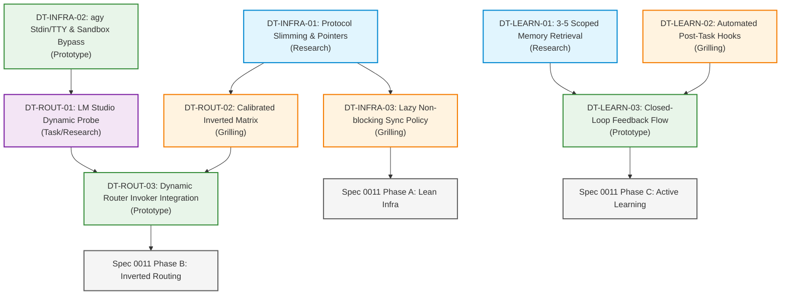

# Wayfinder Map: Auto-Routing Architectural Reorganization (Spec 0011)

## Destination

רה-ארגון ארכיטקטוני מלא ומודרניזציה למערכת ה-`auto-routing` להשגת:
1. **Zero-Latency Boot:** הפחתת משקל החוקים המוזרקים (<4KB), ביטול נעילות `fcntl.flock` חוסמות בעלייה ומניעת תקיעות TTY/Stdin ב-`agy`.
2. **Local & Flash First Hierarchy:** הפיכת Tier 0 (חינם מקומי ב-LM Studio) ו-Tier 1 (זול ומהיר ב-`agy` Flash) לברירות מחדל קשיחות למשימות שגרתיות/פשוטות/קונטקסט, תוך שריון מודלי High-End (Claude Sonnet/Opus, Codex Sol) אך ורק למשימות ארכיטקטורה ו-Multi-file מורכבות.
3. **Active Context & Automated Learning:** שליפה סלקטיבית של 3–5 תובנות רלוונטיות בלבד מתוך `institutional-memory.md` (במקום הזרקת 90KB) וחיבור Hooks אוטומטיים לרישום תוצאות ביצוע (Tests/Review) ללא צורך ברישום ידני.

---

## Notes & Context

- **Current State:** הצטברות משקל עודף מספקים קודמים (Specs 0001–0010, 34 כרטיסי Backlog), קבצי פרוטוקול ענקיים (>22KB ב-`AGENTS.md`/`CLAUDE.md`), שריפת קרדיטים מיותרת וזיכרון מנותק.
- **Tools & Environments:** Antigravity IDE, Claude Code CLI, Codex CLI, Antigravity CLI (`agy`), LM Studio (`http://127.0.0.1:1234/v1`), LiteLLM Router.
- **Core Principle:** ארכיטקטורת Deep Modules — ממשקים ציבוריים צרים ועמוקים, הפרדה ברורה בין מנגנוני סנכרון לבין ניתוב בזמן ריצה.

---

## Decisions so far

1. **אימוץ תבנית Wayfinder:** כל צעד מוגדר ככרטיס החלטה (Decision Ticket) לפני כתיבת קוד ייצור, כאשר כל כרטיס מייצר הכרעה ולא רק תוצר קוד.
2. **חלוקה לשלושה צירים אורתוגונליים:** תשתית (Infrastructure), ניתוב (Routing), ולמידה (Learning).
3. **סדר פעולות ופיצול משימות:** שימוש ב-`/to-spec` ו-`/to-tickets` להפקת מפרט מדויק (`Spec 0011`) וכרטיסי ביצוע מבודדים.
4. **מדיניות LM Studio לא זמין (התרעה ובקשת אישור):** כאשר `LM Studio` כבוי או ללא מודל טעון, המערכת תתריע ותשאל האם להדליקו או להמשיך לענן.
5. **תמצות זיכרון ארגוני קיים:** תמצות 103 התובנות הקיימות ל-20 כללי זהב מרוכזים וחדים, והעברת יתר ההיסטוריה לארכיון.
6. **מבנה פרוטוקול רזה (~4KB):** השארת שער החסימה (Hard Gate) וטבלת ניתוב מקוצרת בקובץ הראשי, והעברת דוגמאות ומדריכים מפורטים ל-`SKILL.md` ו-`REFERENCE.md`.
7. **תנאי סף למודלי High-End (שילוב כמות ומהות):** הפעלת Claude Sonnet/Opus או Codex Sol רק בשינוי של 5+ קבצים / ארכיטקטורה / DB, או במשימות תכנון ראשוני (`/plan`), באגים מורכבים (ניסיון 2+) ואבטחה.
8. **רישום למידה אוטומטי כפול:** רישום אוטומטי של טסטים (Pass/Fail) מיד בסיום ההרצה, ורישום של ביקורת קוד (Review) בעת אישור אנושי / סוכן ביקורת.
9. **זיהוי מודל פעיל ב-LM Studio:** המערכת תבצע בדיקת זמינות וגילוי יכולות של המודל הטעון ב-API ותבחר את ההתאמה המיטבית למשימה.
10. **שליפת זיכרון משולבת (תגיות + מילות מפתח):** שליפה דינמית של 3–5 תובנות רלוונטיות לפי תחום המשימה ומילות המפתח שלה.
11. **שער אימות רב-שכבתי:** בדיקות אוטומטיות מלאות (Unit/Integration), בדיקת עמיתים Council Review, והרצת משימת אמת מקצה לקצה.

---

## Decision Tickets by Axis

### 🏗️ ציר 1: תשתית ואתחול מהיר (Zero-Latency Infrastructure)

#### `DT-INFRA-01` (Research — AFK)
- **שאלה להכרעה:** כיצד לצמצם את קובץ הפרוטוקול המוזרק (`protocol.md` / `AGENTS.md`) מ-22KB לפחות מ-4KB, תוך שמירה על ה-Hard Gate, Worker Mode Override ומנגנון ה-Routing Audit ללא פרצות?
- **סוג:** Research (AFK)
- **תפוקה מצופה:** תוכנית היררכיית קבצים (Core Rules מול Pointers ל-`SKILL.md`/`REFERENCE.md`), כולל ניתוח השפעה על 3 ה-Harnesses (`Antigravity`, `Claude`, `Codex`).
- **חוסם:** `DT-INFRA-03`, `DT-ROUT-02`

#### `DT-INFRA-02` (Research / Prototype — HITL)
- **שאלה להכרעה:** מהי מעטפת ההרצה (Wrapper) ואבטחת ה-Stdin/EOF (`< /dev/null`, IPC loopback handling) שמבטיחה ש-`agy` ופועלי CLI לא ייתקעו לעולם על TTY או חסימות Sandbox של ה-IDE?
- **סוג:** Prototype / Research (HITL)
- **תפוקה מצופה:** תבנית הרצה מוכחת (Run Command Pattern) עם `BypassSandbox: true` ואימות מניעת Hanging Process.
- **חוסם:** `DT-ROUT-01`

#### `DT-INFRA-03` (Grilling — HITL)
- **שאלה להכרעה:** כיצד לעצב את מנגנון ה-Sync ב-`install.sh` ו-Startup כך שיהיה Lazy ו-Non-blocking, ללא מנעולי קבצים מסורבלים (`fcntl.flock`) הגורמים ל-Timeouts?
- **סוג:** Grilling (HITL)
- **תפוקה מצופה:** ADR מוסכם על מדיניות הסנכרון וה-Locking באתחול.
- **תלוי ב-:** `DT-INFRA-01`
- **חוסם:** Spec 0011 Phase A

---

### 🔀 ציר 2: מדרג ניתוב הפוך (Local & Flash First Routing)

#### `DT-ROUT-01` (Task / Research — AFK)
- **שאלה להכרעה:** כיצד לממש Probe דינמי מהיר ואסינכרוני מול LM Studio (`/v1/models`) שמזהה מודל פעיל ב-0ms עיכוב, ומבצע Fallback מיידי ללא חסימת הפעלת המשימה?
- **סוג:** Task / Research (AFK)
- **תפוקה מצופה:** מפרט מנגנון ה-Healthcheck והקונפיגורציה של LM Studio מול ה-Invoker.
- **תלוי ב-:** `DT-INFRA-02`
- **חוסם:** `DT-ROUT-03`

#### `DT-ROUT-02` (Grilling — HITL)
- **שאלה להכרעה:** מהם הקריטריונים והתנאים המדויקים להקצאת Tier 0 (חינם ב-LM Studio), Tier 1 (מהיר/זול ב-`agy` Flash), ו-Tier 2/3 (Claude/Codex), וכיצד למנוע "זליגת קרדיטים" למשימות פשוטות?
- **סוג:** Grilling (HITL)
- **תפוקה מצופה:** טבלת מטריצת ניתוב מעודכנת ומחייבת ב-`protocol.md` ו-`routing-config.json`.
- **תלוי ב-:** `DT-INFRA-01`
- **חוסם:** `DT-ROUT-03`

#### `DT-ROUT-03` (Prototype — HITL)
- **שאלה להכרעה:** כיצד ישולב הניתוב הדינמי החדש בתוך `production_invoker.py` ו-`agent_council.py`, תוך תמיכה במודל היברידי (Planner מקומי/Flash מול Critic חכם)?
- **סוג:** Prototype (HITL)
- **תפוקה מצופה:** בדיקת היתכנות הרצה של משימת בדיקה מלאה במודל Tier 0/1.
- **תלוי ב-:** `DT-ROUT-01`, `DT-ROUT-02`
- **חוסם:** Spec 0011 Phase B

---

### 🧠 ציר 3: מנוע למידה אקטיבי (Active Retrieval & Automated Hooks)

#### `DT-LEARN-01` (Research / Task — AFK)
- **שאלה להכרעה:** מהו מנגנון השליפה היעיל ביותר (Tag-based, Scoped Keywords, או SQLite/BM25 קל) לדליית 3–5 תובנות רלוונטיות מתוך `institutional-memory.md` מבלי להעמיס על חלון ההקשר?
- **סוג:** Research (AFK)
- **תפוקה מצופה:** מודל נתונים ואינדקס לזיכרון הארגוני עם ממשק שליפה מהיר.
- **חוסם:** `DT-LEARN-03`

#### `DT-LEARN-02` (Grilling — HITL)
- **שאלה להכרעה:** באילו נקודות במחזור החיים (סיום טסטים ב-TDD, אישור PR/Review, סיום Session) יופעלו ה-Hooks האוטומטיים לרישום Ground-Truth ב-`learning_outcomes.py` ללא צורך בהתערבות ידנית?
- **סוג:** Grilling (HITL)
- **תפוקה מצופה:** ארכיטקטורת Hooking מוסכמת המתועדת ב-ADR.
- **חוסם:** `DT-LEARN-03`

#### `DT-LEARN-03` (Prototype — HITL)
- **שאלה להכרעה:** כיצד לוודא שהתובנות שנלמדו ומדדי הביצוע (Scoreboard) משפיעים בזמן אמת על החלטות הניתוב (Closed-Loop Calibration) ללא יצירת Deadlocks?
- **סוג:** Prototype (HITL)
- **תפוקה מצופה:** Prototype של מעגל סגור: הרצה -> תיעוד אוטומטי -> עדכון דירוג הראוטר.
- **תלוי ב-:** `DT-LEARN-01`, `DT-LEARN-02`
- **חוסם:** Spec 0011 Phase C

---

## 🗺️ Dependency Graph & Frontier

### The Frontier (כרטיסים זמינים לפתיחה מיידית — Unblocked)
1. 🟢 `DT-INFRA-01` (Research - AFK): מיפוי וצמצום קובצי הפרוטוקול.
2. 🟢 `DT-INFRA-02` (Prototype / Research - HITL): תיקוף מעטפת ההרצה של `agy` ומניעת TTY Hangs.
3. 🟢 `DT-LEARN-01` (Research - AFK): תכנון מודל שליפה סלקטיבי מתוך הזיכרון הארגוני.
4. 🟢 `DT-LEARN-02` (Grilling - HITL): הגדרת נקודות החיבור עבור Automated Post-Task Hooks.

---

## 🌫️ Not yet specified (Fog of War)

- **מדיניות שיתוף מודלים מקומיים מבוזרת:** האם לתמוך ב-Ollama במקביל ל-LM Studio, או להתמקד ב-OpenAI-compatible endpoint של LM Studio בלבד.
- **טקטיקת שמירת היסטוריית למידה ישנה:** האם לארכב את 103 התובנות הקיימות ב-`knowledge/archive/` או לייצר מהן תקציר High-Density אחיד.
- **שילוב LiteLLM כ-Proxy מקומי קבוע:** האם להריץ daemon מקומי קל של LiteLLM או להסתפק בראוטינג הפנימי של `production_invoker.py`.

---

## 🚫 Out of scope

- שינוי הליבה של אלגוריתמי ה-Debate (Planner-Critic) של `agent_council.py` שכבר נבדקו והוכחו בספק 0004.
- תמיכה בספקי ענן צד שלישי שאינם חלק מההסכמים והטוקנים המוגדרים (למשל Cohere, Mistral API).
- שכתוב של כלי סנכרון חיצוניים שאינם חלק מתהליך ה-`install.sh` והפרוטוקול.
