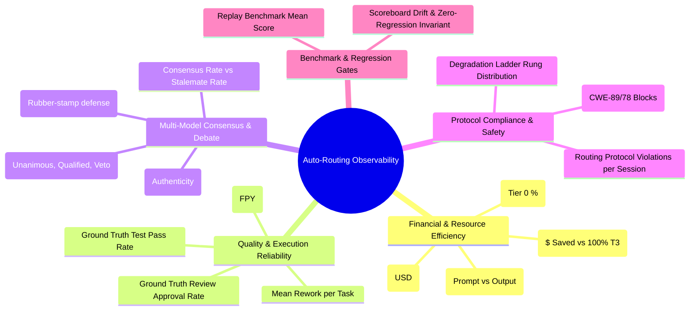

# Visual Learning Metrics & UI/UX Observability Specification

* **Date:** 2026-08-23
* **Target Ticket:** Ticket 44 (`.scratch/routing-backlog/issues/44-visual-learning-report-and-dashboard.md`)
* **Primary Sources:**
  - `skills/worker-routing/learning_scoreboard.py` (8 Canonical Scoreboard Metrics)
  - `skills/worker-routing/learning_journal.py` (5 Signal Families: `worker_execution`, `ground_truth`, `dialogue_quality`, `compliance`, `replay_benchmark`)
  - `skills/worker-routing/learning_report.py` (Weekly Markdown Report & Trend Analysis)
  - `skills/worker-routing/acceptance_gate.py` (Benchmark Replay & Regression Invariant Gates)
  - `docs/specs/0009-unified-consultation-and-council-engine.md` (Council Review, Dyads, Security Veto)

---

## 1. Executive Summary & Problem Domain

The Auto-Routing system orchestrates heterogeneous foundation models across four distinct tiers:
- **Tier 0 (Local $0):** LM Studio / Qwen 3.8 27B MLX
- **Tier 1 (Fast / Cheap):** Gemini 3.7 Flash, Codex Terra / Luna
- **Tier 2 (Heavy Doer):** Claude Sonnet 5
- **Tier 3 (System 2 / Deep Thinking):** Codex Sol, Claude Opus 5, Multi-Agent Debate Panels

While `learning_journal.jsonl` and `.ralph/routing_telemetry.jsonl` continuously record empirical telemetry, inspecting system health currently requires raw CLI queries or terminal logs. Ticket 44 specifies an interactive, standalone HTML dashboard generator (`learning_report_html.py`).

---

## 2. Comprehensive Metric Taxonomy

Based on the codebase's existing state and architectural specifications, the dashboard visualizes metrics grouped into **5 Core Analytical Dimensions**:

### Dimension A: Financial & Resource Efficiency
1. **Cost per Completed Task (`cost_per_completed_task_usd`):**
   * Source: `learning_scoreboard.EfficiencyMetrics`
   * Direction: `lower_is_better`
   * Calculation: Sum of all `worker_execution.cost_usd` divided by completed tasks (`tests` or `review` ground truths).
2. **Baseline Cost Arbitrage & Savings Multiplier:**
   * Formula: $\text{Savings} = \sum (\text{Task Tokens} \times \text{Tier 3 Rate}) - \sum \text{Actual Cost}$.
   * Provides immediate ROI visibility on local ($0) and Tier 1 routing offloads.
3. **Tier Distribution & Local Offload Ratio:**
   * Proportion of executions resolved at T0 ($0) vs T1 vs T2 vs T3.

### Dimension B: Execution Quality & Ground-Truth Reliability
4. **Mean Rework per Task (`mean_rework_per_task`):**
   * Source: `learning_scoreboard.EfficiencyMetrics`
   * Direction: `lower_is_better`
   * Calculation: Count of distinct `run_id`s per `task_id` minus 1.
5. **First-Pass Yield (FPY):**
   * Formula: $\text{Tasks with 0 Rework} / \text{Total Completed Tasks}$.
6. **Ground-Truth Verification Rate:**
   * Source: `learning_journal.OutcomeRecord`
   * Tracks automated test pass rate and code review acceptance rate per model family.

### Dimension C: Critique Authenticity & Consensus
7. **Dialogue Non-Consensus / Stalemate Rate (`dialogue_non_consensus_rate`):**
   * Source: `learning_scoreboard.EfficiencyMetrics`
   * Direction: `lower_is_better`
   * Percentage of deliberations requiring human escalation or resulting in stalemate.
8. **Critique Authenticity & Engagement (`mean_engagement_count`):**
   * Source: `learning_scoreboard.CritiqueAuthenticityMetrics`
   * Direction: `higher_is_better`
   * Verified quotes and atomic objections per review round to prevent rubber-stamping.
9. **Canary Catch Rate (`canary_catch_rate`):**
   * Direction: `higher_is_better`
   * Proactive injection test catching blind approvals.

### Dimension D: Protocol Discipline & Safety Bounds
10. **Violations per Session (`violations_per_session`):**
    * Source: `learning_scoreboard.DisciplineMetrics`
    * Direction: `lower_is_better`
    * Monitored by `routing-audit.sh` and recorded via `ComplianceRecord`.
11. **Security Veto Triggers (`SECURITY_HALT`):**
    * Source: `debate_state_machine.py` / Spec 0009
    * Tracks non-majority halts triggered by `reviewer_security` or Critical CVE findings.
12. **Degradation Ladder Rung Distribution (`degradation_rung`):**
    * Source: `AdvisoryTelemetryRecord.degradation_rung`
    * Tracks budget degradation from Rung 0 (Full) to Rung 1 (Reduced rounds), Rung 2 (Local single model), and Rung 3 (Budget skipped).

### Dimension E: Benchmark Stability
13. **Replay Benchmark Mean Score (`mean_benchmark_score`):**
    * Source: `learning_scoreboard.ReplayBenchmarkMetrics` & `acceptance_gate.py`
    * Direction: `higher_is_better`
    * Grades candidate routing proposals against fixed regression task sets.

---

## 3. UI/UX Design System & Layout Architecture

### A. Design Principles
* **Light Mode & RTL Native:** Clean, warm cream/slate palette tailored for Hebrew typography (Heebo / Rubik) with explicit `dir="rtl"` alignment.
* **Single-File Zero-Dependency Architecture:** Generates a standalone `.html` file with embedded CSS and vanilla JS — portable, double-clickable, zero server requirement.
* **Dynamic State Inspector:** Explicit status bar communicating active filters, dataset date range, and total journal record count.
* **Progressive Disclosure & Interactive Drill-Down:**
  - High-level KPI summary cards at the top.
  - Multi-tab breakdown (Model Performance, Consensus & Debates, Safety & Audits).
  - Searchable and filterable event logs with modal detail drawer on click.

---

## 4. Implementation Roadmap for Ticket 44

1. **Step 1:** Complete interactive high-fidelity Stitch prototype and generate reference layout.
2. **Step 2 (TDD):** Create unit tests in `skills/worker-routing/test_learning_report_html.py` asserting HTML generation, metric formatting, and escaping from journal fixtures.
3. **Step 3 (Core Implementation):** Build `skills/worker-routing/learning_report_html.py` compiling scoreboards and journal reads into the standalone dashboard.
4. **Step 4 (CLI Integration):** Add `--html` option to `learning_report.py`.
5. **Step 5 (Code Review):** Run parallel Standards and Spec audit.
